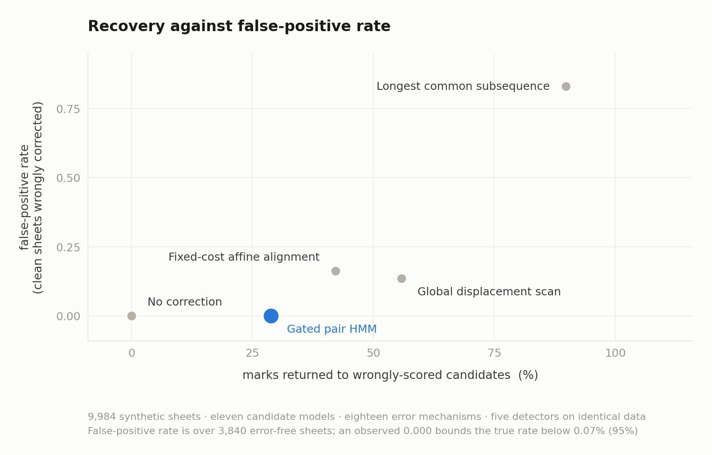

# Detecting registration errors in OMR answer sheets

Optical mark recognition (OMR) produces two sequences: an answer key indexed by question number, and student marks indexed by physical row. Standard marking assumes these indices correspond. A registration error occurs when marks are physically correct but shifted relative to question numbers. The cause may be a scanner feed slip or, more often, a candidate skipping a bubble row while filling the sheet and continuing one row low; the detector cannot distinguish them and does not need to, because the correction is the same. Displacement (row shift) is the most common form. Skiena and Sumazin (2004) measured displacement in 1.8% of 101,265 exam papers.

This repository contains a detector for registration errors, two synthetic evaluation benchmarks, and audit documentation. The work began with the analysis of a disputed examination sheet and expanded into a benchmark for evaluating registration error detectors.

> **Status:** Research implementation. Validated on synthetic corpora. Not validated for operational deployment or cohort screening.

---

## At a glance

* **5 detectors compared** on identical sheets: no correction, global displacement scan, LCS, fixed-cost affine alignment, and the gated pair HMM (recommended).
* **5 acceptance criteria**, all required: Bayes factor ≥ 100, posterior ≥ 0.95, Monte Carlo p ≤ 0.01 against the worst of three nulls, every displaced segment ≥ 5 items and above chance at p ≤ 0.01, and a non-identity registration. Marks are then awarded per question where the item posterior exceeds 0.99, and questions that turn wrong are counted as losses.
* **10,464 synthetic sheets** across two corpora with independent generators, both scoring all five detectors: 480 sheets over 10 behaviour models and 9 mechanisms, and 9,984 over 11 behaviour models and 18 mechanisms including scanner artefacts and adversarial sheets.
* **Zero false positives observed on both corpora.** Bounds follow sample size: 22.1% per generator on corpus 1 (12 error-free sheets each), 0.07% on corpus 2 (3,840 pooled), 0.20% in the profile study (1,500). Zero observed is not zero risk; see Key Limitations for the condition that breaks it.
* **28.8% to 41.2% recovery**, depending on corpus and profile, while awarding the same unearned marks as making no corrections at all (0.006 per sheet at the 1.8% base rate).
* **0.20 s per sheet, from 1.56 s.** Batched permutation scanning and a precomputed binomial tail table removed roughly 700,000 scalar calls per adjudication. Output verified bit-identical, including with numpy absent.

---

## Problem

Alignment search inflates scores even when no registration error exists. Under longest common subsequence (LCS) alignment, a random 46-question 4-option sheet scores an average of 27.3 out of 46 (chance expectation: 11.5).

The detector is designed to avoid false corrections first, then maximize recovery under that constraint.

---

## Detector design

The primary detector uses a Gated Pair Hidden Markov Model (HMM) over monotone lattice paths. 

The implementation differs from a conventional alignment model in three places:
* **Marginalized candidate ability:** Candidate ability is marginalized over a Beta prior and is never fitted to the disputed sheet. Fitting ability directly to a disputed paper creates circular reasoning, as finding an alignment artificially inflates the fitted ability.
* **Permutation-based acceptance:** Acceptance requires passing a Monte Carlo permutation test that preserves candidate run structure. The permutation gate uses no ability model, making safety invariant to asserted ability claims.
* **Item-level re-registration:** Passing acceptance does not award marks in bulk. Items are re-registered individually where marginal posterior probability exceeds 0.99, and questions that become incorrect under an alignment reduce the awarded score.

---

## Evaluation & Performance

Five alignment models were measured across two synthetic corpora:

### Corpus 1: Benchmark Model Comparison (480 sheets)

| Alignment Model | Worst-case FPR | Unearned Marks (Raw) | Unearned Marks (1.8% Base Rate) | Recovery Rate |
|---|---|---|---|---|
| No correction (Baseline) | 0.00 | 0.24 | 0.006 | 0% |
| Global displacement scan | 0.42 | 0.47 | 0.239 | 31% |
| Longest common subsequence | 1.00 | 4.26 | 3.689 | 100% |
| Fixed-cost affine alignment | 0.75 | 1.08 | 0.555 | 94% |
| **Gated Pair HMM** | **0.00** | **0.25** | **0.006** | **31%** |

At the historical 1.8% base rate, the Gated Pair HMM matches the no-correction baseline on unearned marks (0.006 per sheet) while recovering 31% of lost marks.

Worst-case FPR is the maximum across the ten generators, each measured on 12 error-free sheets. An observed 0.00 in a cell bounds that generator's rate below 22.1% at 95% confidence (Clopper-Pearson, exact) — 12 sheets is a weak bound, and the figures are reported per generator rather than pooled, because a pooled average hides the generator under which a method fails. Corpus 2 is where the false positive claim is actually bounded, on 3,840 error-free sheets. Zero observed is not zero risk. The raw unearned-marks column is a mean over benchmark cells holding three error sheets per error-free sheet, and is not a deployment expectation; the 1.8% column reweights it to the measured base rate.

### Corpus 2: Large-Scale Evaluation, Independent Generator (9,984 sheets)

All five detectors, scored on identical sheets, with false-positive rates over 3,840 error-free sheets rather than 12 per generator.



| Detector | False positives | FPR | Recovery | Unearned marks |
|---|---|---|---|---|
| No correction | 0 of 3,840 | 0.000 | 0% | 2,793 |
| **Gated Pair HMM** | **0 of 3,840** | **0.000** | **28.8%** | **2,835** |
| Global displacement scan | 519 | 0.135 | 55.8% | 11,235 |
| Fixed-cost affine alignment | 625 | 0.163 | 42.2% | 19,975 |
| Longest common subsequence | 3,188 | 0.830 | 89.8% | 141,684 |

Making no correction already awards 2,793 unearned marks, because some sheets are contaminated before the detector sees them. The gated model's excess over that floor is **42 marks across 9,984 sheets**. Longest common subsequence accepts 83% of clean sheets and awards an excess of 138,891.

---

## Operating Profiles

Acceptance thresholds are exposed as three pre-calibrated operating profiles:

| Profile | Threshold $\alpha$ | Mark Recovery | Detections (150 Skips) | Smallest Block Accepted |
|---|---|---|---|---|
| Conservative | 0.001 | 23.0% | 23 of 150 | 11 correct answers |
| **Balanced (Default)** | **0.010** | **34.9%** | **41 of 150** | **10 correct answers** |
| Sensitive | 0.050 | 41.2% | 52 of 150 | 8 correct answers |

`Balanced` is the default configuration. Across 300 error-free sheets, `Conservative` yielded no fewer false positives than `Balanced`, while recovering one-third fewer marks on genuine skips.

---

## Disputed Case Audit Summary

Audit of a candidate scoring 7 out of 46 in mathematics produced a Monte Carlo $p$-value of 0.901 and a Bayes factor favoring no shift. Re-registration was rejected, and the original score stood. A planted shift on the same key was detected and corrected. Full details are in [CASE_REPORT.md](CASE_REPORT.md).

---

## Key Limitations

* **Low overall recovery:** Mark recovery is ~29%. Overall detection power on Corpus 2 is 0.094; the detector stays silent on 9 out of 10 genuine shifts to protect against false positives.
* **Mislocation rate:** 302 of 880 detections (34%) misidentified the change-point location, flagging the sheet without returning credit.
* **Detection floor:** Requires a contiguous block of 8 to 11 correct marks at non-zero offset depending on profile, and 10 at the default. On a 20-question paper this is a large share of the sheet, so short exams are poorly served. Sheet designs that confine a slip to a small block make errors cheaper and simultaneously undetectable; REPORT.md section 11.1 gives the trade-off.
* **Single-sheet evidence only:** A displaced block of correct answers is treated as a registration error regardless of how it arose. A candidate copying from a neighbour whose sheet was displaced produces identical evidence and can be accepted. Detecting copying is outside the scope of this tool.
* **Synthetic validation:** All evaluation relies on synthetic corpora. Operational calibration requires confirmed historical cases. The closest prior work, Cook (2013), evaluated on approximately 40,000 real examinees and operates with false discovery rate control at cohort scale; this package does neither. REPORT.md section 3.7 sets out where the two agree and where this one comes off worse.

---

## Documentation Index

```
REPORT.md             Technical report and experimental evaluation
CASE_REPORT.md        Analysis of the motivating examination sheet
ASSUMPTIONS.md        Design assumptions and what the measurements showed
REPRODUCE.md          Commands to regenerate every result
data/README.md        Data sources and how each corpus is generated
Colab_demo.ipynb      Runs the detector in a browser, no install
```

---

## Quickstart

Python 3.9 or later. Detection and adjudication use the standard library only;
`numpy` and `matplotlib` are needed for the figures and the benchmarks.

```bash
pip install -r requirements.txt
python3 benchmark/verify_corpus.py     # Verification suite (~1 min)
python3 omr_shift.py                   # Core detector & case analysis
python3 benchmark/omrbench.py --n 12    # Benchmark comparison
python3 benchmark/large_synthetic.py --full   # Corpus 2 evaluation (~2.1 hours)
```
