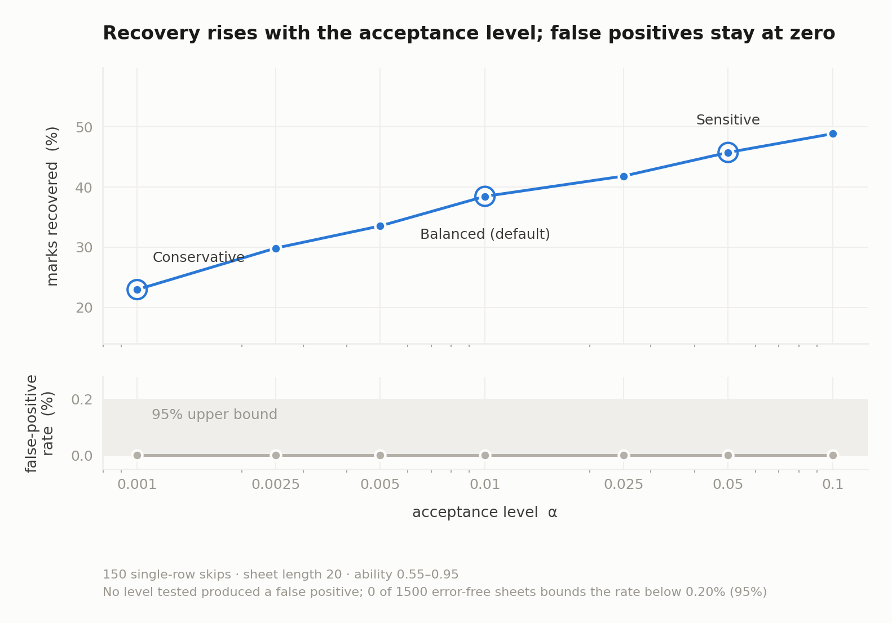

# Detecting registration errors in OMR answer sheets

Technical report. Covers the problem, the models evaluated, the comparison
between them, the recommended configuration, and the safeguards against misuse.

The case that prompted the work is in [CASE_REPORT.md](CASE_REPORT.md).
Assumptions stated during design and then measured are in
[ASSUMPTIONS.md](ASSUMPTIONS.md).

**Status.** Research implementation. Not validated for operational deployment.
Validation is entirely synthetic and the reported confidence has not been
validated at the deployment base rate. False discovery rate control across a
sitting is implemented and measured: on a 4,000-candidate synthetic sitting
sitting a 46-question paper it flags 22 sheets with none wrong, and on a
20-question paper it flags none at all. Sections 6.2 and 6.3 give the mechanism
and the paper-length requirement behind that difference. Section 11 states the
limitations in full.

**Tooling.** Implementation was assisted by Claude (Anthropic).

---

## 1. The problem

Optical mark recognition produces two indexed sequences: an answer key indexed by
question number, and a set of marks indexed by physical row on the sheet.
Marking assumes these indices correspond. A **registration error** is any failure
of that correspondence in which the marks themselves are correct but are compared
against the wrong questions. The cause may lie in the scanner or in the
candidate: a feed slip and a skipped bubble row produce the same failure of
correspondence, and the same correction. The term is used here for the mechanics
of the index mapping, not for the machine.

Displacement, commonly called a shift error, is one member of the family. The
full set considered here:

| Class | Mechanism | Effect on the index map |
|---|---|---|
| Displacement | a bubble row is skipped | monotone increase of offset |
| Displacement | a question is skipped without skipping its row | monotone decrease of offset |
| Reordering | sheet scanned inverted, or filled bottom-up | reversal |
| Reordering | answers entered against the wrong column or block | block permutation |
| Reordering | wrong booklet version applied at marking | arbitrary permutation |
| Symbol | bubble columns mis-registered at scan | relabelling of the option alphabet |
| Symbol | incorrect key legend | relabelling of the option alphabet |

Skiena and Sumazin (2004) measured displacement errors in 1.8% of 101,265
Scholastic Aptitude Tests, corroborated at approximately 2% on Stony Brook
undergraduate examinations. At national scale this is thousands of affected
candidates per sitting.

### 1.1 Why detection alone is insufficient

For any sheet, searching over displacements and retaining the best-scoring
alignment improves the score. This holds regardless of whether an error occurred,
because the search itself guarantees it. The problem is discrimination, not
detection.

The magnitude is quantifiable. Under longest common subsequence scoring, the
maximally permissive correction rule, a uniformly random 46-item sheet scores
27.3 of 46 against a chance expectation of 11.5. Skiena and Sumazin give the
asymptotic result using Dancik's adaptability measure: for an alphabet of size
α = 4, a candidate with no knowledge scores between 0.58 and 0.75 where chance
gives 1/α = 0.25, and the maximising strategy is to answer in long runs of a single
option.

Any method permissive enough to recover a genuine error is, without additional
constraints, permissive enough to manufacture one.

---

## 2. Formulation

Let **k** = (k₁ … k_N) be the key indexed by question and **m** = (m₁ … m_M) the
marks indexed by row, over an option alphabet of size C.

A registration is a partial injection π from questions to rows subject to:

1. **Monotonicity.** q < q′ implies π(q) < π(q′) on the domain of π.
2. **Injectivity.** No row is read twice.
3. **Bounded displacement.** |π(q) − q| ≤ D.
4. **Zero credit for unmatched questions.** q ∉ dom π scores zero.

The marks are not decision variables. Constraint 1 implies the offset
δ(q) = π(q) − q is non-decreasing on the matched domain, decreasing only where a
question leaves the domain; a decreasing offset without an unmatched question
would require re-reading a consumed row, which no physical sheet produces.

Under this formulation the set of admissible registrations is the set of monotone
lattice paths on the (question, row) grid. The four constraints are properties of
that path set. No validation check is applied to a candidate solution.

---

## 3. Models evaluated

Five approaches were implemented and measured against identical data.

### 3.1 Global displacement scan

Evaluate each δ ∈ [−D, D], retain the maximum-scoring, accept if the score gain
exceeds a threshold.

Cannot represent multiple error events or unanswered questions, and optimises
score directly. Included as the naive reference.

### 3.2 Longest common subsequence

Score the longest subsequence common to marks and key. Handles displacement
implicitly and requires no parameters.

Permits unpenalised deletion in both sequences, which is equivalent to discarding
every question answered incorrectly. Included because it is the intuitive
generous approach and because its exploitability has a published bound.

### 3.3 Affine-gap alignment with fixed costs

Gotoh's algorithm, a variant of Needleman-Wunsch global alignment with separate
gap-open and gap-extension penalties, over the banded lattice. Structurally
correct: monotonicity and injectivity hold by construction.

The costs are chosen constants without probabilistic interpretation, so the
output is an unnormalised score. No confidence statement can be derived, and the
constants are a negotiable surface at appeal.

### 3.4 Three-state pair hidden Markov model, ungated

The standard pair hidden Markov model for sequence alignment (Durbin et al.,
1998), applied to a response alphabet in place of a biological one. The model is
not original to this work; what is specific here is the response model it emits
under and the acceptance layer in 3.5.

States M (question matched to row), X (question unmatched), Y (row unmatched).
Emissions are log-likelihood ratios under an explicit response model:

```
P(m_r | k_q, θ) = θ                if m_r = k_q
                  (1 − θ)/(C − 1)   otherwise
```

Transition costs are log-priors derived from the base rate of slips. Decoded by
the Viterbi algorithm for the maximum a posteriori registration, the forward
algorithm for the marginal likelihood, and forward-backward for per-question
posterior distributions over offset.

### 3.5 Three-state pair HMM with a gated decision layer

Model 3.4, with acceptance governed by five criteria evaluated after decoding.
This is the recommended configuration and is described in section 5.

### 3.6 Approaches considered and not adopted

**Integer programming** over the assignment polytope with monotonicity cuts. The
monotone constraint set is totally unimodular, so the linear relaxation is
integral and dynamic programming attains the same optimum in linear time. IP adds
a solver dependency without additional expressive power.

**Markov chain Monte Carlo** over registrations. The banded lattice has
approximately 3·N·(2D+1) states, which is small enough to enumerate exactly.
Sampling introduces Monte Carlo error into a quantity available in closed form
and invites convergence disputes into an appeals process.

**An item response theory detector.** Cook (2013) applies IRT to this problem:
two statistics over a 3PL and a nominal response model, thresholds set by false
discovery rate, evaluated on approximately 40,000 real examinees. No IRT rival is
implemented here, so no comparison exists; the four baselines are all string
matching. Two of his findings match measurements here. Estimating ability from
the disputed sheet is circular, which A1 reaches independently and resolves by
taking ability from outside the sheet. Detection favours high-ability candidates,
which section 11 also reports. He has real data and cohort-scale false discovery
control; this package has neither.

**Conditional random fields and weighted finite-state transducers.** Both subsume
the pair HMM. Given the same information, a 46-item response vector and a key,
neither adds capacity under constraints 1 to 4, and the additional parameters
would be fitted without labelled data. That reasoning does not extend to richer
inputs: either could incorporate scanner confidence, bubble darkness, section
boundaries or cohort response frequencies while preserving the monotone path
constraint, and section 11 argues those are where improvement now lies. They were
excluded for want of data, not for want of expressive power.

**Supervised classification.** No labelled corpus of confirmed errors exists. A
learned decision boundary cannot be explained at an appeal, and drifts silently
between sittings.

**Change-point detection** (CUSUM, binary segmentation) applied to the
correctness indicator. Useful as a screening filter across a cohort, but cannot
enforce injectivity and does not produce a registration. Retained in
`analysis/latent_structure.py` as one of four independent break-point detectors
used for corroboration, not as a primary method.

---

## 4. Comparison

480 sheets: 10 candidate models by 4 conditions (no error, one-row skip, two-row
skip, two slips) by 12 sheets. Every detector sees identical data. Full design in section 8.

| Model | Worst-case FPR | Unearned, raw | Unearned at 1.8% | Recovery | Brier | Schema |
|---|---|---|---|---|---|---|
| No correction | 0.00 | 0.24 | 0.006 | 0% | 0.750 | 1.00 |
| Global displacement scan (3.1) | 0.42 | 0.47 | 0.239 | 31% | 0.481 | 1.00 |
| Longest common subsequence (3.2) | 1.00 | 4.26 | 3.689 | 100% | undefined | 0.53 |
| Fixed-cost affine alignment (3.3) | 0.75 | 1.08 | 0.555 | 94% | undefined | 0.83 |
| **Gated pair HMM (3.5)** | **0.00** | **0.25** | **0.006** | 31% | **0.2092** | **1.00** |

At the historical 1.8% base rate the recommended model awards the same unearned
marks as making no corrections, 0.006 per sheet. The alternatives award 40 to 615
times more. The raw column is a mean over cells that are 75% error sheets.

Worst-case FPR is the maximum false positive rate across the ten candidate
models. Recovery is the proportion of marks lost to an error that the method
returns. Brier score measures calibration of the reported confidence; lower is
better, and it is undefined for methods producing no confidence. Schema is the
proportion of the required decision fields the method populates.

### 4.1 Which performed better

No model dominates on all measures. Four lie on the Pareto frontier, so ranking
requires a stated objective.

Under the objective of minimising unearned marks, the gated pair HMM (3.5) is the
only model matching the no-correction baseline on worst-case false positive rate
(0.00). It awards 0.19 unearned marks per sheet, the same figure as taking no
action, while recovering 33% of lost marks.

Under the objective of maximising recovery, fixed-cost affine alignment (3.3)
returns 99%, and LCS (3.2) reaches 100% with a worst-case FPR of 1.00. Their
position on the frontier reflects that nothing recovers more, not that either is
usable.

### 4.1.1 Where the aligners fail, and why the gate does not

The worst case is not spread evenly across generators, and the pattern identifies
the failure rather than merely bounding it.

| Generator | no correction | gated pair HMM | displacement scan | fixed-cost | LCS |
|---|---|---|---|---|---|
| adversarial_adaptable | 0.00 | **0.00** | 0.42 | **1.00** | 1.00 |
| streaky_guesser | 0.00 | **0.00** | 0.00 | 0.42 | 1.00 |
| nonstationary_ability | 0.00 | **0.00** | 0.00 | 0.17 | 1.00 |
| two_regime | 0.00 | **0.00** | 0.00 | 0.17 | 0.92 |
| topic_clustered | 0.00 | **0.00** | 0.00 | 0.00 | 0.67 |
| irt_2pl | 0.00 | **0.00** | 0.00 | 0.00 | 0.58 |
| clean | 0.00 | **0.00** | 0.00 | 0.00 | 0.50 |
| attractive_distractor | 0.00 | **0.00** | 0.00 | 0.00 | 0.42 |
| time_truncated | 0.00 | **0.00** | 0.00 | 0.00 | 0.33 |
| option_bias | 0.00 | **0.00** | 0.00 | 0.00 | 0.25 |

Fixed-cost alignment accepts every error-free sheet from `adversarial_adaptable`,
and fails on exactly four generators: that one, `streaky_guesser`,
`nonstationary_ability` and `two_regime`. Each produces **runs** — long stretches
of one option, or a regime change leaving a locally coherent block. It is clean
on all six generators that do not. This is the exploit Skiena and Sumazin
describe, arriving where they predict it: a candidate answering in long runs
manufactures blocks that look displaced and correct, and a method scoring against
fixed constants cannot ask whether such a block is surprising. It finds the best
alignment and reports it.

The gated model is at 0.00 on all ten. The reason is the permutation layer rather
than the response model: two of the three nulls, rotation and block bootstrap,
resample the candidate's own answers in a way that preserves their run structure.
A streaky candidate's null distribution therefore contains streaks, their
coherent block is no more surprising than their own answering behaviour predicts,
and the sheet is rejected. Measured on 300 error-free sheets, those two nulls are
the binding constraint 88% of the time — rotation 185 times and block bootstrap
79.

This is the clearest single piece of evidence for the acceptance layer in section
5. Section 3.3 objects that the fixed-cost constants are a negotiable surface at
appeal, which is true and abstract; this is the concrete form of the same
objection.

Two cautions on reading the table. Each cell is 12 error-free sheets, so an
observed 0.00 bounds that cell below 22.1% and no lower — the false positive
claim for the gated model rests on the 3,840 clean sheets of section 6.5, not
here. And the table's purpose is to show *which conditions* break a method, which
is why the figures are never pooled.

### 4.2 Detection by candidate ability and error magnitude

| Assumed ability θ | One-row displacement | Two-row displacement |
|---|---|---|
| 0.85 | 0.800 | 0.400 |
| 0.70 | 0.633 | 0.217 |
| 0.55 | 0.200 | 0.017 |

Detection depends on the internal consistency of the candidate's answers. A
candidate whose responses are near chance cannot produce a displaced block
distinguishable from noise at any displacement, so the method is materially less
effective for weaker candidates. This is a property of the evidence, not of the
implementation, and it is discussed in section 9.

### 4.3 Detection by error mechanism

Reference model, with the no-correction baseline in brackets.

| Mechanism | Detection | Localisation error | Marks withheld |
|---|---|---|---|
| No error (control) | 0.000 | | |
| Displacement from an early question, running to the end | 0.971 | 0 | 2.21 (19.76) |
| Displacement noticed and corrected mid-paper | 0.714 | 0 | 2.91 (9.96) |
| Question deferred and answered last | 0.671 | 1 | 3.77 (13.29) |
| Displacement beginning at a column boundary | 0.643 | 1 | 3.19 (11.11) |
| Displacement with degraded answers around it | 0.457 | 3 | 3.10 (9.20) |
| Single answer misplaced and recovered | 0.000 | | 1.23 (1.23) |

The first row is the mechanism candidates report most often and the most costly,
at roughly 21 marks. The last row is a negative case worth one mark, where
correcting causes more harm than leaving alone.

---

## 5. Recommended model and decision rule

Model 3.5. The optimiser produces a candidate registration; a separate layer
determines whether to accept it. An optimiser asked for the best registration
always returns one, so the two are kept apart.

### 5.1 Acceptance criteria

All five must pass.

| Criterion | Statistic | Default |
|---|---|---|
| Evidence ratio | log₁₀ Bayes factor, H₁ marginalised over all non-identity registrations and over ability | ≥ 2.0 (Jeffreys decisive) |
| Posterior | P(error \| marks) after applying the base rate as prior odds | ≥ 0.95 |
| Monte Carlo | permutation p-value of the coherence scan statistic, worst of three nulls | ≤ 0.001 |
| Segment coherence | exact binomial tail per displaced segment | p ≤ 0.01, length ≥ 5 |
| Non-triviality | MAP registration differs from the identity | required |

### 5.2 The test statistic

Four statistics were measured against a planted error and a Monte Carlo null:

| Statistic | p-value on a genuine planted displacement |
|---|---|
| Forward evidence ratio | 0.025 |
| Viterbi score gain | 0.018 |
| Raw score gain | 0.143 |
| **Coherence scan** | **0.0003** |

Raw score gain, the statistic implicit in model 3.1, reported a genuine
displacement at p = 0.14. The discriminating feature is contiguity of the gained
marks, not their number. The adopted statistic is a scan statistic over
displacement and window:

```
T = max over d ≠ 0, and over contiguous windows W with |W| ≥ L,
    of  −log₁₀ P(at least k of |W| correct | chance = 1/C)
```

with exact binomial tails. Multiplicity across all (d, W) pairs is handled by the
Monte Carlo null maximising over the same search space; the Šidák correction is
used where an analytic correction is reported instead.

The three nulls are: resampling the key from its own option marginals; circular
rotation of the candidate's marks by an amount outside the displacement band,
which preserves run structure; and a block bootstrap of the marks. The largest
p-value of the three is reported.

### 5.3 Item-level award

Passing all five criteria does not award marks in bulk. A question is
re-registered only where its posterior on the MAP offset, from forward-backward,
exceeds 0.99. Questions adjacent to a change point, where either registration is
plausible, retain their original registration. Questions that become incorrect
under the accepted registration are counted as losses.

### 5.4 The break-even quantity

```
break-even = −log ε / [ log θ − log((1 − θ)/(C − 1)) ]
```

where ε is the per-position hazard of a slip and θ the assumed ability. This is
the number of answers a correction must repair before the evidence outweighs the
prior improbability of the error. At ε derived from a 1.8% sheet rate and
θ = 0.6, it is 5.22 questions.

---

## 6. Configuration for an examination board

Every parameter below is a policy input, not a tuning constant. Defaults are
stated with their source.

| Parameter | Default | Source, and what a board should substitute |
|---|---|---|
| `sheet_slip_rate` | 0.018 | Skiena and Sumazin's measured rate. Replace with the board's own re-mark history. Scales the break-even directly. |
| `external_ability` | prior mean | Must come from the candidate's other subjects under a published rule, computed before the appeal is opened. Never from the disputed sheet. |
| `max_displacement` | 3 | An assumption. Estimate from confirmed historical cases. Widening it widens the search space linearly. |
| `item_posterior_threshold` | 0.99 | Per-question confidence required before re-registration. |
| `blank_safety` | 0.5 | Enforces the constraint in 7.2. Do not raise above 1.0. |

Two entries have left that table. The acceptance level is now set by choosing a
profile; 6.1 gives the reason. `min_segment_length` is no longer offered at all,
because it decided nothing in 150 sheets and the floor it appears to set is
imposed elsewhere. See A6. It remains an internal constant.

### 6.1 The acceptance profile

```python
cfg = AdjudicationConfig.from_policy(Policy.BALANCED)
```

Three profiles. An examination board selects one and records the selection.

| | Conservative | Balanced | Sensitive |
|---|---|---|---|
| α | 0.001 | 0.010 | 0.050 |
| Recovery | 23.0% | 34.9% | 41.2% |
| Detection | 23 of 150 | 41 of 150 | 52 of 150 |
| Marks wrongly removed | 0 | 0 | 0 |
| Change points mislocated | 0 | 0 | 0 † |
| Smallest block ever accepted | 11 correct | 10 correct | 8 correct |
| Draws required | 9,999 | 999 | 199 |

150 single-row skips, ability 0.55 to 0.95, sheet length 20. Recovery is for that
population and is not a deployment expectation. Every figure in this section
comes from `results/policy_profiles.txt`; the command that regenerates it is in
REPRODUCE.md.

† That zero belongs to single-row skips, not to the detector. A skipped row is
the mechanism the model represents most directly, and it is the only mechanism
in this population. Other mechanisms localise worse. Section 4.3 gives the
median error per mechanism: 0 questions on `early_full_shift` and
`self_corrected_shift`, 1 on `deferred_question` and `boundary_slip`, 3 on
`anxiety_shift`. Mislocation costs recovery. The sheet is flagged and the marks
are not credited. Safety is unaffected.



The false positive rate is not a per-profile figure. Accepting at a tight α is a
subset of accepting at a loose one, so one measurement at a level looser than
any profile bounds all three: **0 false positives in 1500 error-free sheets at
α = 0.1, which is 0.20% at 95% confidence** (Clopper-Pearson).

Turning that into marks needs two numbers from outside this measurement: the
1.8% base rate that Skiena and Sumazin measured, and an assumption of ten
unearned marks per false acceptance. On those, the bound works out at 0.0196
unearned marks per sheet, against 0.006 for making no corrections. The observed
figure is zero.

The ten-mark assumption is not measured, because no false acceptance occurred to
measure it on, and the result scales directly with it. The comparison of 0.0196
against 0.006 establishes that the observed rate is zero and the true rate is
below 0.20%. It does not establish that the loosest level is as safe as making no
corrections. A tighter bound requires more error-free sheets at the same level.

Four properties of the profiles follow from A6.

**The acceptance level is not a false positive rate.** Measured against 300
error-free sheets, the reported p-value falls below a nominal 0.5 in 8.3% of
cases, below 0.25 in 2.7% and below 0.1 in 0.7%. The reported value is the worst
of three null models, and the binding one preserves the candidate's own answer
runs, which makes it strict. Each profile carries measured characteristics. No
profile states a target rate.

**The profiles differ in recovery and not in measured safety.** Every safety
column is identical across the three. Balanced returns two-thirds again as many
marks as Conservative under the same certified bound, and Sensitive twice as
many.

**The smallest block accepted is a measured capability.** No profile accepts a
displaced block smaller than the figure shown. Loosening the level by two orders
of magnitude moves that floor by three marks. On a 20-question paper a floor of
eight correct marks occupies a large share of the sheet, so a looser profile does
not make short papers materially more recoverable.

**The three levels are conventional and not derived.** 0.001, 0.01 and 0.05 are
the standard significance levels, which are standard because the level is
normally a false positive rate. A6 establishes that it is not one here.

The measurements do not supply a replacement rule. Recovery rises smoothly with
the level, with no point at which a level is selected by the data, and the
observed false positive count is zero at every level tested. A choice made on
these measurements alone would take the loosest level.

The default is set tighter than that because both corpora are synthetic and no
confirmed historical case exists to check the null against. These measurements
cannot distinguish a safe level from one whose failure mode neither generator
produces. An examination board holding its own re-mark history should set the
level from confirmed cases.

`n_permutations` is derived from the profile and cannot be set separately. The
two quantities are not independent: set apart, they can produce a gate that no
p-value can pass. An unreachable combination raises on construction.

### 6.2 Cohort screening

Every criterion above applies to a single sheet. Screening a whole sitting and
acting on the sheets that pass is a different problem: a per-sheet rate that is
negligible once is not negligible ten thousand times.

`CohortScreen` adds the layer that problem needs. It runs a Benjamini-Hochberg
step-up over the per-sheet p-values at a target false discovery rate *q*,
publishes the expected number of false discoveries for the sitting, and monitors
the trigger rate. The layer can only remove sheets, never add them, so screening
a sitting is never more permissive than adjudicating the sheets one at a time.

Two details decide whether it works at all.

The first is resolution. The smallest p-value the permutation test can report is
1/(n+1), so a cohort needs enough draws per sheet for the step-up threshold to be
reachable. Below that count no sheet can clear the threshold and the screen
returns zero flagged whatever the sheets contain — silently. `draws_required`
derives the count from the cohort size and `check_resolution` refuses a run that
cannot resolve, rather than reporting an empty result.

The second is the trigger monitor's reference value. The share of sheets a
correctly calibrated screen should flag is not the base rate of errors, it is the
base rate multiplied by the detector's power. At the 1.8% base rate and the
measured power of 0.112 that is 0.202%, not 1.8%. A monitor set to the base rate
would treat normal operation as a tenfold shortfall.

### 6.3 What it needs to work: paper length

The screen works, and the condition it depends on is worth stating precisely,
because a board can check it before running anything.

On a synthetic sitting of 4,000 candidates sitting a **46-question** paper at the
1.8% base rate, it flags 22 sheets and none of them is wrong. Sixty-one sheets
carried a genuine skip; the per-sheet gate found 33 of them, and the cohort layer
kept 22. The step-up threshold settles at 1.0 × 10⁻⁴, expected false discoveries
are published in advance as 1.10, and the observed count is zero. No false
positives on 3,939 error-free sheets, bounding that rate below 0.076%.

On the **same code and the same cohort size with a 20-question paper**, it flags
nothing at all. The per-sheet gate found 24 sheets and was wrong about none; the
cohort layer discarded every one.

The whole difference is how much evidence a slip can leave behind. A displaced
sheet is only surprising over the questions that follow the slip, and the
detection floor already asks for a contiguous block of 8 to 11 correct marks.
On a 20-question paper that is half the sheet, so almost nothing is left over to
push the p-value down; on 46 questions there is room to spare. Measured directly
on displaced sheets, the reported p-value is:

| Questions | reported p (worst of three nulls) |
|---|---|
| 20 | 6.5 × 10⁻⁴ to 6.8 × 10⁻³ |
| 46 | at the resolution floor, no exceedances |
| 80 | at the resolution floor, no exceedances |

The binding null is the block bootstrap, and at 20 questions it is what stops the
sheet. Buying more draws does not help: that null genuinely admits
displaced-looking blocks at a rate near 10⁻³, and reporting the worst of three is
the deliberate choice made in section 5. What helps is a longer paper.

So the requirement is a lower bound on paper length relative to cohort size, not
a defect in the procedure. At *m* = 4,000 and *q* = 0.05 the first rung sits at
1.25 × 10⁻⁵, and a 46-question paper clears it. A short paper does not, and for
a sitting of 4,000 on a 20-question paper the arithmetic is hopeless in both
directions: reaching the rung needs *q*/*m* ≥ 10⁻³, so *m* ≤ 38, or else *k* ≈ 80
sheets already clearing it against the 24 available.

Two consequences for a board. Short papers should be screened in strata small
enough that *m* stays in the low tens — by scanner batch or examination room,
which also matches the mechanism, since a feed slip is a batch-level event. And
the multiple-comparisons cost is real even when the screen works: 11 of 33
correct per-sheet detections were discarded at 46 questions. That is the price of
bounding false discoveries across a sitting, and it is paid in recall.

What is not recommended is reporting the binding null alone. It would clear any
threshold immediately, and it trades away the assumption-free safety argument
that is the reason to trust a per-sheet verdict at all.

Every sheet is synthetic and the base rate is Skiena and Sumazin's rather than
any board's own. Section 11 states what else is missing.

### 6.4 The default

The default is Balanced. The first version of this work used Conservative.

The measurement does not support the tighter level. Across 300 error-free sheets
Conservative produced no fewer false positives than Balanced, and across 150
genuine skips it returned a third fewer marks. No measured safety benefit
corresponds to the recovery it costs.

Sensitive is not the default because both corpora are synthetic and no confirmed
historical case is available to check the null against.

Every figure in this report and in `results/` is produced at the current default.
Changing profile changes them. REPRODUCE.md regenerates all of it.

### 6.5 The second corpus

`benchmark/large_synthetic.py` holds 9,984 sheets across eleven candidate
behaviour models and eighteen error mechanisms, including scanner artefacts and
adversarially filled sheets. Output is in `results/large_synthetic/`. The two
corpora share no code beyond the detector.

Scoring all five detectors rather than the recommended model alone is deliberate.
A validation corpus that scores only the chosen model cannot show that the choice
was wrong, and this corpus contains conditions the first does not: scanner
artefacts, adversarially filled sheets, four sheet lengths and five-option
papers. Its false positive rates rest on 3,840 error-free sheets rather than the
twelve per generator that corpus 1 provides.

| Reference detector, 9,984 sheets, shipped default | |
|---|---|
| True positives | 688 |
| Detections mislocated | 207 |
| **False positives** | **0 of 3,840** |
| False positive rate, 95% bound | 0.0007 |
| Power | 0.112 |
| Recovery | 0.279 |
| Marks returned to candidates | 29,036 |
| Unearned marks awarded | 2,703 |

Making no correction awards 2,665 unearned marks on this corpus, because some
sheets are contaminated before the detector sees them. The excess attributable to
the detector is **38 marks across 9,984 sheets**, against 29,036 marks returned:
a ratio of 764 marks recovered per mark wrongly awarded.

On the same sheets the global displacement scan accepts 520 error-free sheets and
longest common subsequence accepts 3,201 of 3,840, awarding an excess of 138,584
unearned marks against the no-correction floor.

Mislocation is the standing cost. 207 of 895 detections, 23%, identify a sheet as
displaced but place the change point wrongly, which flags the sheet without
returning credit. Section 11 lists this among the limitations.

The choice of default level is argued in section 6.4 from the profile study,
which varies the level on a dedicated corpus with every other threshold held
fixed. This corpus is reported at the shipped default only.

---

## 7. Safeguards against misuse

The concern is that a correction system creates an incentive to produce sheets
that invite correction. Five safeguards, of which the first three are structural.

### 7.1 Answers are not decision variables

The search is over monotone lattice paths. A path representing a modified,
reordered or invented answer does not exist in the search space. No configuration
value, operator action or defect can produce one.

### 7.2 Unmatching is priced above admitting a wrong answer

A wrong match costs log((1 − θ)/(C − 1)); an unmatched question costs log ε_blank.
Where the latter exceeds the former, discarding a question becomes cheaper than
admitting it was answered incorrectly, and the model can purchase alignment
freedom by discarding its own errors. This occurs above θ ≈ 0.93 at realistic
blank rates, and was found by the startup check during development. The blank
cost is now clamped:

```
log ε_blank(θ) = min( log ε_blank , log((1 − θ)/(C − 1)) + log(blank_safety) )
```

with `blank_safety` < 1, so the ordering holds at every θ by construction. This
is the specific defence against the LCS failure mode: LCS permits free deletion,
which is exactly the move this clamp prices out.

### 7.3 Credit requires contiguity, not quantity

Scattered gains do not accumulate into an acceptance. A contiguous block of
correct answers at a fixed non-zero displacement cannot be constructed without
knowledge of the key, and a candidate with that knowledge has no reason to
misregister their answers.

The published adversarial strategy is to answer in long runs of one option. The
rotation null preserves the candidate's own run structure, so run-heavy sheets
are compared against a null with the same run structure and gain nothing from it.

### 7.4 Losses are counted

Questions that become incorrect under an accepted registration reduce the awarded
score. Selective application of favourable changes is not available.

### 7.5 The binding criterion uses no ability model

The ability estimate is supplied by a person and cannot be contradicted by the
sheet, making it the most exposed input. Escalating it:

| Claimed prior evidence | Evidence ratio criterion | Monte Carlo criterion | Verdict |
|---|---|---|---|
| 10 items | fail | fail | rejected |
| 120 items | fail | fail | rejected |
| 500 items | fail | fail | rejected |
| 1000 items | **pass** | fail | rejected |
| 5000 items | **pass** | fail | rejected |

The evidence ratio criterion can be bought. It passes at a claim of 1,000 prior
items of evidence. The Monte Carlo criterion did not move in any of the eight
conditions, because it uses no ability model. Governance should concentrate
there.

`results/gate_stress_test.txt` holds all eight rows.

---

## 8. Benchmark design

`benchmark/omrbench.py`. Results in `results/benchmark.txt`.

No public benchmark for this problem was found. Published OMR
research addresses image processing: bubble localisation, deskewing, page
registration. The subsequent question of whether an extracted response sequence
was recorded against the correct questions has been handled case by case.

Results are reported per generator and never pooled, since a single averaged
figure conceals the conditions under which a method fails.

**Ten candidate models.** One is the reference model, constant ability with
uniform distractors, which violates nothing and exists as the control. The other
nine each violate a specific assumption: 2PL item response theory with
varying difficulty and discrimination; topic-clustered difficulty; a distractor
attracting 65% of errors; monotonically declining ability; a two-regime candidate
imitating a change point; time-truncated responses; a streaky guesser; option
bias under uncertainty; and Dancik's maximum-adaptability string, which is
constructed to exploit permissive correction.

**Nine error mechanisms**, modelled on candidate accounts. Injection is not
uniformly random. They run in two harnesses. Three basic ones, a one-row skip, a
two-row skip and two separate slips on one sheet, drive the comparison in section
4. Six drawn from how candidates describe going wrong drive the per-mechanism
table in section 4.3. The tables are therefore from two runs of the same code
over different mechanism sets, not one run reported twice.

**Three measurement families:** detection, harm split into marks wrongly awarded
and marks wrongly withheld, and transparency measured as schema completeness,
localisation error, and calibration by Brier score and expected calibration
error.

**A known advantage to the reference model.** The candidate models generate at
ability 0.85 and the gated pair HMM is configured with the same value, so it is
given a parameter the baselines have no equivalent of. The advantage was measured
by re-running with the ability withheld: detection 0.67 when told the true value,
0.63 given a neutral prior of 0.60, and 0.27 given a badly wrong 0.40. False
positives remained at zero in all three. The reported detection figures should
therefore be read as an upper bound, roughly four points above what a deployment
supplying ability from other subjects would achieve, and the false positive
figures as unaffected, since the Monte Carlo criterion uses no ability model.

**A uniform decision schema** returned by every detector including the baselines:
accepted, shift locations, confidence, evidence, explanation, alignment. Methods
that cannot populate a field are scored on it.

`RealDataSet` defines a schema for confirmed historical cases and is empty. Fifty
confirmed re-marks would replace the two largest assumptions, the base rate and
the displacement distribution, with measurements.

---

## 9. Confidence, and what it means operationally

The gated pair HMM is the only evaluated model that reports a confidence figure
at all. Its Brier score is 0.2092 against 0.481 for the displacement scan; the
other two report nothing.

**The Brier and ECE values are comparative metrics on the synthetic benchmark and
do not establish deployment calibration.** They rank detectors on identical data,
which is what they are used for here. They do not show that a reported posterior
of 0.99 corresponds to 99% correctness in board operations. The
benchmark cells contain three sheets with errors for every error-free sheet,
while the reported confidence uses the 1.8% base rate as its prior. A
base-rate-thresholded posterior cannot be validated on a test set whose base rate
is 75%. Establishing that a reported 0.99 means 99% of such registrations are
correct requires a test set at the deployment base rate, which in turn requires
the confirmed historical cases described in section 8. Until then the calibration
claim is comparative between models, not absolute.

In operational terms, at the default configuration:

- A sheet that passes has produced evidence that fewer than 1 in 1000 error-free
  sheets produces, under the least favourable of three null models.
- A question that is re-registered has at least 99% posterior support for that
  specific row.
- Unearned marks run at 0.25 per sheet against 0.24 for making no corrections.
  **Both are means over benchmark cells that are 75% error sheets, roughly 42
  times the historical rate.** Reweighted to 1.8% both fall by more than an order
  of magnitude; the benchmark now reports the reweighted figure alongside the raw
  one. Neither is a prediction of what a board would see, because the mechanism
  mix in deployment is unknown.
- The false positive rate is below 1.65% on 180 error-free sheets and below 2.47%
  on 120 adversarial ones, as separate Clopper-Pearson exact bounds with zero
  events in each. The two conditions are different populations and the bounds are
  not interchangeable; pooling all 300 would give roughly 1%. None of these is
  zero, and reporting zero would be misleading at cohort scale.

---

## 10. Complexity

With N questions, D maximum displacement, G ability grid points, B Monte Carlo
draws:

| Stage | Time | Space |
|---|---|---|
| Viterbi, forward, forward-backward | O(N·D) each | O(N·D) |
| Ability marginalisation | O(G·N·D) | O(N·D) |
| Coherence scan | O(D·N²) with prefix sums | O(N) |
| Monte Carlo calibration | O(B·D·N²) | O(B) |

Banding to bounded displacement makes the alignment linear. Unbanded it is
quadratic.
Direct enumeration of change-point sets is O(N^K·(2D)^K), exponential in the
number of events.

One sheet takes approximately 0.22 seconds at the default 999 draws, or 0.13
seconds with early termination enabled, measured on a 20-question paper.

The Monte Carlo stage dominates that time, and is evaluated in batches. Draws are
generated one at a time so the random stream is unchanged, and the coherence
statistic is computed for a chunk of draws in one array operation. Scanning a
single sheet under an array library is no faster than the scalar loop, because
the arrays are too small to cover the call overhead; scanning a chunk is between
three and seven times faster depending on the sheet. Output is identical either
way, and the scalar path is used when numpy is absent.

The Monte Carlo stage also terminates early when asked. Acceptance at α = 0.01
with 999 draws admits at most 9 exceedances, so the tenth settles the outcome and
the remaining draws cannot alter it. Termination there is exact.

Implemented in Python with no optimisation library. Dynamic programming,
log-space arithmetic, exact binomial tails, Clopper-Pearson bounds, Rasch joint
maximum likelihood estimation, Lempel-Ziv complexity and McNemar's exact test are
all written out.

---

## 11. Limitations

The full record, including six assumptions that were tested and not supported, is
in [ASSUMPTIONS.md](ASSUMPTIONS.md).

**Recovery is 31%, and unevenly distributed.** The method returns roughly a third
of the marks lost to a registration error, and materially less for weaker
candidates: detection falls from 0.80 at assumed ability 0.85 to 0.20 at 0.55. A
candidate whose responses are near chance cannot produce a displaced block
distinguishable from noise.

An examination board adopting the method should define in advance what route
exists for candidates it cannot serve, and should not present statistical
adjudication as the only remedy available. Two attempts to
improve this produced no measurable change: 3PL item response theory emissions
calibrated by Rasch JMLE (item difficulty recovered at r = +0.992, detection 26
of 40 against 25 of 40), and the same information relocated into the coherence
statistic (detection 0.768 against 0.773 over 220 paired sheets, McNemar exact
p = 1.000). The evidence suggests the limit is informational: the coherence
statistic depends almost entirely on chance alignment, and very little on the
response model, so refinements to the response model do not move the decision. Improvement
requires additional data, such as the candidate's other sections, scanner erasure
marks, or per-question timing.

**Non-stationary ability imitates a change point.** A candidate strong early and
weak later produces the same piecewise structure. The coherence requirement
discriminates in most cases, because a genuine decline tends to sit at the
identity alignment. A candidate whose weak section coincidentally aligns at a
non-zero displacement cannot be separated. Sectioned papers should be adjudicated
by section.

**Correlated item difficulty inflates apparent coherence.** Questions sharing a
topic cluster, so a run of correct answers may reflect topic knowledge. The
chance baseline of 1/C is then incorrect and p-values are anti-conservative.
Correction requires cohort response frequencies.

**Non-monotone registrations cannot be represented.** A question deferred and
answered in the final row produces a decreasing offset, which constraint 1
excludes. The best monotone sub-registration recovers 72% of the affected marks,
leaving the single deferred question unrecoverable.

**The scoring rule is not applied.** This code counts correct answers. The
marking record for the case that prompted it awards 1 for a correct answer and
−0.15 for a wrong one. A board using penalised scoring must apply its own rule to
the resulting registration; the score this software reports is not the board's
score.

**Ability marginalisation is grid-approximated.** The integral over ability uses
a 25-point midpoint rule, not a closed form. Bayes factors, posteriors and the
robustness sweep in section 7 all inherit that discretisation error.

**Digitisation is assumed clean.** Double marks, erasures and faint bubbles are
treated as reading correctly. A material proportion of suspected registration
errors are scanner misreads, which inspection resolves more cheaply and more
certainly than inference from the response pattern. Physical re-scanning should
precede statistical adjudication.

### 11.1 Prevention by sheet design, and what it costs

Where the cause is a candidate skipping a bubble row, the sheet itself is a
control the detector is not. Two designs are in common use.

**Visual block grouping.** Answer grids segmented into 5 or 10 question clusters,
separated by heavy rules or alternating shading, so alignment drift cannot
propagate past a block boundary.

**Anchor rows.** Non-scored alignment markers at fixed intervals, which give a
candidate a checkpoint to re-register against.

Both reduce the marks a single slip can cost. Both also remove the evidence this
detector needs, and the two effects are the same effect.

Acceptance requires a contiguous displaced block of 8 to 11 correct marks
depending on profile, and 10 at the default. A slip confined to a 5-question
block cannot produce one. Block grouping therefore caps the damage of an
undetected error at roughly five marks, and in exchange makes any error that does
occur permanently undetectable by this method or any other reading a single
sheet, because the evidence does not exist on the page.

That is a defensible trade for a board to make, and the direction is a matter of
which harm it prefers. It is recorded here because the choice is invisible from
inside the detector: a sheet redesigned this way produces the same output as a
sheet with no errors on it.

### 11.2 What sets the detection floor, and what would lower it

The floor is a property of the search, not of the response model. On a
20-question paper at a displacement bound of 3, the coherence scan tests 632
windows: six non-zero offsets by every start and end pair of at least the
minimum segment length. A displaced block has to beat that burden.

| Block, all correct | p under chance | Expected spurious hits per sheet |
|---|---|---|
| 5 | 9.8 × 10⁻⁴ | 0.62 |
| 6 | 2.4 × 10⁻⁴ | 0.15 |
| 8 | 1.5 × 10⁻⁵ | 0.010 |
| 10 | 9.5 × 10⁻⁷ | 0.001 |

A run of five correct answers at a displaced offset appears by chance on roughly
three fifths of error-free sheets. The measured floor of 10 at the default level
is where expected spurious hits reach 0.001, which is the arithmetic behind the
figure rather than a tuned threshold.

Two consequences follow, and one common proposal is ruled out.

**Candidate ability cannot lower it.** Supplying a prior from prior attainment
changes neither term: it does not reduce the 632 windows, and it does not change
the chance probability of a run. Ability enters the evidence ratio and the
per-item posterior, and A2 measured that the Monte Carlo criterion did not move
across eight escalating assertions of ability because it uses no ability model.
Making the floor respond to ability would restore precisely the vulnerability
that measurement documents.

**Restricting the search lowers it to about six.** If the plausible offsets and
change points were known in advance — page breaks, column boundaries, anchor
rows — the burden falls from 632 windows to roughly 8. A six-item block then
gives 8 × 2.4 × 10⁻⁴ ≈ 0.002, close to the safety of a ten-item block today.
That is a gain of three or four items, and it is bounded there.

**Reaching five needs more evidence per item.** Beating a 632-window search at
p ≤ 0.001 costs about 19.3 bits. A binary match on a four-option question
supplies 2 bits, which is why ten items are required. Five items would need
roughly 3.9 bits each, about twice what a correct-or-incorrect comparison can
carry. Optical density, erasure marks and double-bubble evidence are candidates
because they are not in the response vector at all; a better model of that vector
is not, which is what A4 found from the other direction.

---

## References

Grouped by how each is used, so the list is not read as more than it is.

### Implemented in this repository

Gotoh, O. (1982). An improved algorithm for matching biological sequences.
*Journal of Molecular Biology* 162(3), 705–708. The affine-gap baseline in
section 3.3, a variant of Needleman and Wunsch (1970).

Needleman, S. B. and Wunsch, C. D. (1970). A general method applicable to the
search for similarities in the amino acid sequence of two proteins. *Journal of
Molecular Biology* 48(3), 443–453.

Viterbi, A. J. (1967). Error bounds for convolutional codes and an
asymptotically optimum decoding algorithm. *IEEE Transactions on Information
Theory* 13(2), 260–269. Decoding of the maximum a posteriori registration.

Rasch, G. (1960). *Probabilistic models for some intelligence and attainment
tests*. Danish Institute for Educational Research. The single-ability emission
model is a Rasch model with item difficulties tied to zero.

Birnbaum, A. (1968). Some latent trait models and their use in inferring an
examinee's ability. In Lord, F. M. and Novick, M. R., *Statistical Theories of
Mental Test Scores*. Addison-Wesley. The three-parameter logistic with
discrimination and pseudo-guessing used in `extensions/irt_model.py`.

Clopper, C. J. and Pearson, E. S. (1934). The use of confidence or fiducial
limits illustrated in the case of the binomial. *Biometrika* 26(4), 404–413.
Every false positive bound in this report.

Wilson, E. B. (1927). Probable inference, the law of succession, and statistical
inference. *Journal of the American Statistical Association* 22(158), 209–212.
Used in place of the exact bound for pooled figures at large n.

Jeffreys, H. (1961). *Theory of Probability*, 3rd edition. Oxford University
Press. The decisive band the Bayes factor criterion tests against.

Davison, A. C. and Hinkley, D. V. (1997). *Bootstrap Methods and their
Application*. Cambridge University Press. The add-one permutation p-value
estimator, which never reports zero.

Benjamini, Y. and Hochberg, Y. (1995). Controlling the false discovery rate: a
practical and powerful approach to multiple testing. *Journal of the Royal
Statistical Society, Series B* 57(1), 289–300. The step-up procedure in
`CohortScreen`, described in section 6.2.

McNemar, Q. (1947). Note on the sampling error of the difference between
correlated proportions or percentages. *Psychometrika* 12(2), 153–157. The
paired test in A4.

Lempel, A. and Ziv, J. (1976). On the complexity of finite sequences. *IEEE
Transactions on Information Theory* 22(1), 75–81. The complexity measure in
CASE_REPORT.md section 8.

### Source of the alignment model

Durbin, R., Eddy, S., Krogh, A. and Mitchison, G. (1998). *Biological Sequence
Analysis: Probabilistic Models of Proteins and Nucleic Acids*. Cambridge
University Press. The three-state pair hidden Markov model in section 3.4 is the
standard alignment model described here, applied to a response alphabet rather
than a biological one. Cited as attribution: the model is not original to this
work.

### The problem, as previously measured

Cook, R. J. (2013). *Application of Item Response Theory Models to the
Algorithmic Detection of Shift Errors on Paper and Pencil Tests*. Doctoral
dissertation, University of Massachusetts Amherst. doi:10.7275/d9sx-mq12.

Skiena, S. and Sumazin, P. (2004). Shift error detection in standardized exams.
*Journal of Discrete Algorithms* 2(3), 313–331. The 1.8% base rate used
throughout, and the result that longest common subsequence scoring is
exploitable. Their asymptotic argument uses Dancik's adaptability measure;
this repository takes the result from them rather than deriving it.

Dancik, V. (1994). *Expected length of longest common subsequences*. PhD thesis,
University of Warwick.

